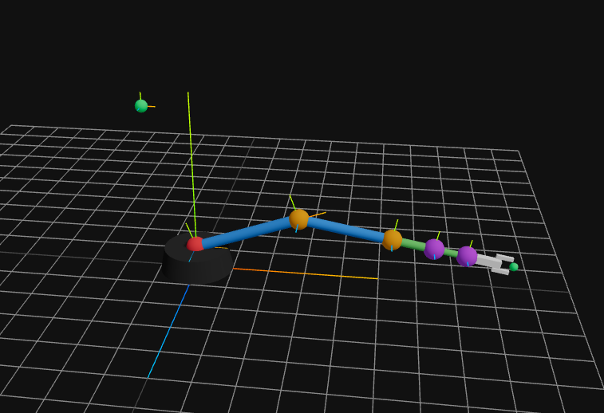
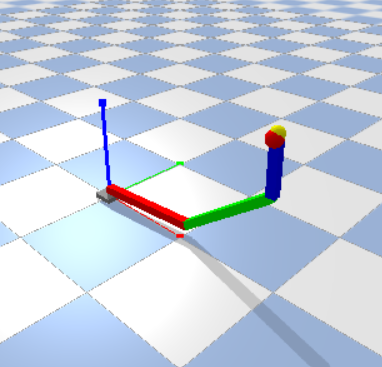
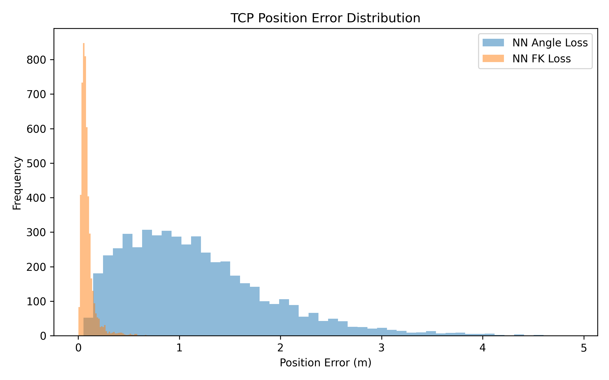
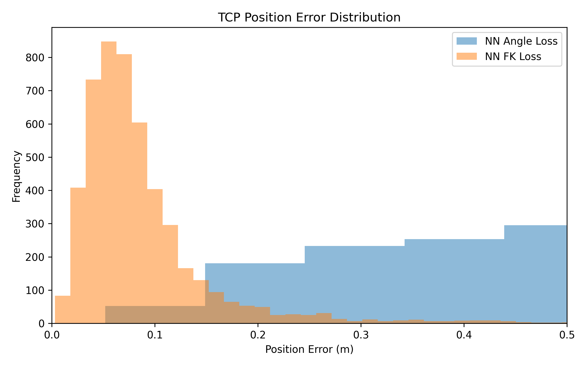
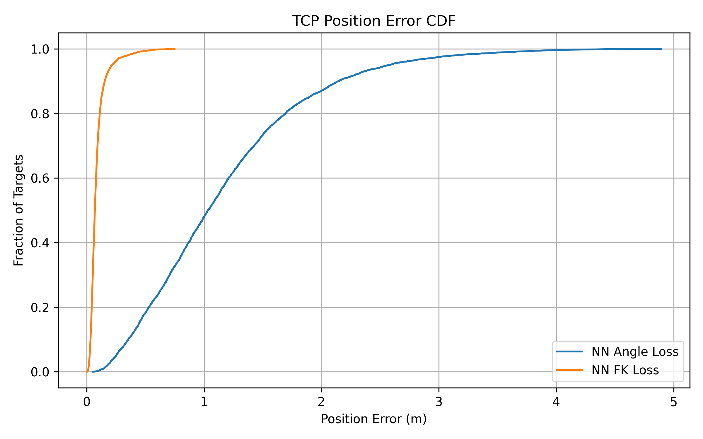

# Neural Inverse Kinematics for a 6-DOF Robot Arm

<p align="center">
  
</p>

## Overview

This project explores whether neural networks can learn inverse kinematics (IK) for robotic manipulators while maintaining real-time inference speed.

The project evolved through two major stages:

1. **v0.1 — 3-DOF PyBullet Proof of Concept**
2. **v0.2 — Full 6-DOF Neural IK System**

The final system combines robotics, machine learning, kinematics, optimization, and web-based simulation to investigate task-space-aware neural inverse kinematics.

---

# Project Evolution

## v0.1 — 3-DOF PyBullet Proof of Concept

<p align="center">
  
</p>

### Goal

Determine whether a neural network can learn inverse kinematics from data.

### Stack

* Python
* PyBullet
* PyTorch
* SciPy

### Robot

* Base Yaw
* Shoulder Pitch
* Elbow Pitch

### Pipeline

```text
Target Position
      ↓
PyBullet IK
      ↓
Joint Angles
      ↓
Train Neural Network
```

### Results

* Test Loss ≈ 0.005
* ~90% target tracking success
* Position Error ≈ 1–7 cm

### Conclusion

Neural inverse kinematics is feasible.

This experiment validated the overall project concept and motivated the transition to a full 6-DOF robot arm.

---

## v0.2 — 6-DOF Neural IK System

### Features

* 6-DOF robot arm simulator
* Custom forward kinematics implementation
* Numerical inverse kinematics solver
* Workspace visualization
* Reachability analysis
* Neural inverse kinematics models
* FK-based dataset generation
* Differentiable FK loss training
* FastAPI inference backend
* Smooth trajectory interpolation

---

# Technology Stack

### Frontend

* React
* TypeScript
* Three.js
* React Three Fiber
* Leva

### Backend

* FastAPI
* PyTorch

### Robotics & Machine Learning

* PyTorch
* NumPy
* SciPy

---

# Robot Architecture

## Joint Configuration

| Joint | Function       |
| ----- | -------------- |
| J1    | Base Yaw       |
| J2    | Shoulder Pitch |
| J3    | Elbow Pitch    |
| J4    | Wrist Pitch    |
| J5    | Wrist Yaw      |
| J6    | Wrist Roll     |

## Dimensions

```text
BASE_HEIGHT      = 0.25
UPPER_ARM_LENGTH = 1.20
FOREARM_LENGTH   = 1.00
WRIST_LENGTH     = 0.45
TOOL_LENGTH      = 0.35
TCP_OFFSET       = 0.50
```

---

# Dataset Generation

Rather than generating training labels using inverse kinematics, the final approach generates data using forward kinematics.

```text
Random Joint Angles
        ↓
Forward Kinematics
        ↓
Pose Dataset
```

Dataset Format:

```text
x, y, z,
qx, qy, qz, qw,
j1, j2, j3, j4, j5, j6
```

Total Samples:

```text
100,000
```

## Why FK-Based Datasets?

Inverse kinematics is inherently ambiguous because multiple joint configurations can reach the same pose.

Using FK-generated datasets:

* Eliminates IK ambiguity
* Produces deterministic labels
* Simplifies quaternion generation
* Scales naturally to 6-DOF pose learning

---

# Experiments

## Experiment 1 — Joint-Space Angle Loss

### Input

```text
Target Pose + Seed Angles
```

### Output

```text
6 Joint Angles (Sin/Cos Representation)
```

### Results

* Joint MAE ≈ 3.8°
* Mean Position Error ≈ 10.7 cm
* Mean Orientation Error ≈ 4.8°

### Observation

Low joint-angle error did not necessarily produce low end-effector position error.

---

## Experiment 2 — Position vs Orientation

### Hypothesis

Position and orientation may not be equally difficult learning tasks.

### Approach

Model A:

```text
Position → Arm Joints
```

Model B:

```text
Orientation → Wrist Joints
```

### Results

* Arm MAE ≈ 14°
* Wrist MAE ≈ 4.6°
* Position Error ≈ 56 cm

### Conclusion

Position prediction is significantly harder than orientation prediction and was identified as the primary bottleneck.

---

## Experiment 3 — Differentiable Forward Kinematics Loss

### Traditional Loss

```python
MSE(predicted_angles, target_angles)
```

### Proposed Loss

```python
angle_loss
+ weighted_position_loss
+ weighted_orientation_loss
```

A differentiable forward kinematics model was incorporated directly into the training loop.

### Results

* Mean Position Error improved from ~10.7 cm to ~5.0 cm
* Significantly better TCP alignment
* Position accuracy improved despite larger joint-angle errors

### Key Insight

Joint-space optimization does not necessarily produce optimal task-space performance.

Optimizing the robot's actual end-effector position proved significantly more effective than optimizing joint angles alone.

---

# Benchmark Results

| Method                 | Mean Position Error | Avg Inference Time |
| ---------------------- | ------------------- | ------------------ |
| Neural IK (Angle Loss) | 1.15 m              | 0.77 ms            |
| Neural IK (FK Loss)    | 0.094 m             | 0.74 ms            |

## Position Error Distribution

<p align="center">
  
  
  
</p>

## Benchmark Observations

* Both models achieve sub-millisecond inference latency.
* FK-loss produces substantially lower TCP position error.
* FK-loss predictions are concentrated significantly closer to the target pose.
* Task-space optimization dramatically improves end-effector positioning performance.

---

# Key Findings

1. Neural inverse kinematics is feasible.

2. FK-generated datasets avoid inverse kinematics ambiguity.

3. Position prediction is harder than orientation prediction.

4. Low joint-angle error does not guarantee low TCP accuracy.

5. Task-space losses significantly improve end-effector positioning performance.

6. Improving TCP position accuracy required sacrificing orientation accuracy.

7. Multiple joint configurations can produce similar end-effector positions, making task-space metrics more meaningful than joint-space metrics.

---

# Future Work

## Robotics

* Self-collision detection
* Obstacle avoidance
* Motion planning
* Trajectory optimization

## Machine Learning

* Orientation-aware FK loss
* Hybrid Neural IK + Numerical IK refinement
* Transformer-based architectures

## Hardware

* Servo motor integration
* PID control
* Physical robot arm deployment

---

# Project Status

Current Version:

```text
v0.3
```

Status:

```text
Research Complete
Benchmarking Complete
Deployment In Progress
```
